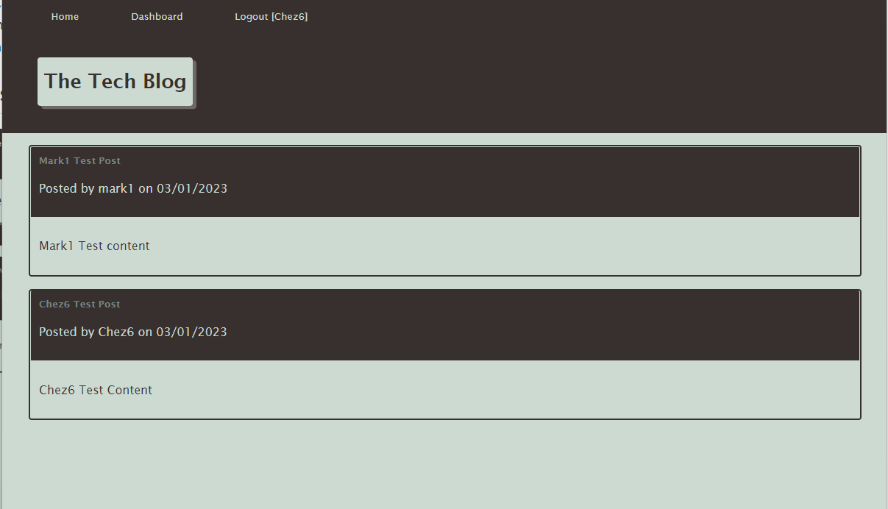

# Tech Blog
 

## Table of Contents
* [Description](#description)
* [User Story](#user-story)
* [Acceptance Criteria](#acceptance-criteria) 
* [Screenshot](#screenshot)
* [Installation](#require) 
* [Features](#features)
* [Live URL](#live-url)
* [Contact Me](#contact-me)
* [Credits](#credits)
* [Testing](#testing)
* [Questions](#questions)
* [License](#license)

## Description
This application is a CMS-style blog site similar to a Wordpress site, where developers can publish their blog posts and comment on other developers’ posts as well. This site has been built completely from scratch and deployed to Heroku. The app follows the MVC paradigm in its architectural structure, using Handlebars.js as the templating language, Sequelize as the ORM, and the express-session npm package for authentication.
 
## User Story
AS A developer who writes about tech  
I WANT a CMS-style blog site  
SO THAT I can publish articles, blog posts, and my thoughts and opinions  
 
## Acceptance Criteria
GIVEN a CMS-style blog site  
WHEN I visit the site for the first time  
THEN I am presented with the homepage, which includes existing blog posts if any have been posted; navigation links for the homepage and the dashboard; and the option to log in  
WHEN I click on the homepage option  
THEN I am taken to the homepage  
WHEN I click on any other links in the navigation  
THEN I am prompted to either sign up or sign in  
WHEN I choose to sign up  
THEN I am prompted to create a username and password  
WHEN I click on the sign-up button  
THEN my user credentials are saved and I am logged into the site  
WHEN I revisit the site at a later time and choose to sign in  
THEN I am prompted to enter my username and password  
WHEN I am signed in to the site  
THEN I see navigation links for the homepage, the dashboard, and the option to log out  
WHEN I click on the homepage option in the navigation  
THEN I am taken to the homepage and presented with existing blog posts that include the post title and the date created  
WHEN I click on an existing blog post  
THEN I am presented with the post title, contents, post creator’s username, and date created for that post and have the option to leave a comment  
WHEN I enter a comment and click on the submit button while signed in  
THEN the comment is saved and the post is updated to display the comment, the comment creator’s username, and the date created  
WHEN I click on the dashboard option in the navigation  
THEN I am taken to the dashboard and presented with any blog posts I have already created and the option to add a new blog post  
WHEN I click on the button to add a new blog post  
THEN I am prompted to enter both a title and contents for my blog post  
WHEN I click on the button to create a new blog post  
THEN the title and contents of my post are saved and I am taken back to an updated dashboard with my new blog post  
WHEN I click on one of my existing posts in the dashboard  
THEN I am able to delete or update my post and taken back to an updated dashboard  
WHEN I click on the logout option in the navigation  
THEN I am signed out of the site  
WHEN I am idle on the site for more than a set time  
THEN I am able to view comments but I am prompted to log in again before I can add, update, or delete comments 
 
## Screenshot

## Installation
1. To setup the application in local, run "npm i" to install the below packages. 
    * bcrypt
    * connect-session-sequelize
    * dotenv
    * express
    * express-handlebars
    * express-session
    * MySQL2
    * sequelize

2. Under the repository folder, open the terminal and login mySQL CLI.  Execute script by issuing command "source db/schema.sql" to create the database. 

3. Quit the mySQL CLI, run "npm start" to load the model to the database. 

## Features
* Uses Node.js and Express.js to create a RESTful API.
* Uses Handlebars.js as the template engine.
* Uses MySQL and the Sequelize ORM for the database.
* Has both GET and POST routes for retrieving and adding new data.
* Has a folder structure that meets the MVC paradigm.
* Includes authentication (express-session and cookies).
* Protects API keys and sensitive information with environment variables.
* Is deployed using Heroku (with data).
* Has a polished UI.
* Is responsive.
* Is interactive (in other words, accepts and responds to user input).
* Meets good-quality coding standards (file structure, naming conventions, follows best practices for class/id naming conventions, indentation, quality comments).

## Live URL 
https://young-savannah-76133.herokuapp.com/
 
## Contact Me
* GitHub: [CheBar1](https://github.com/CheBar1)
* Email: findme@gmail.com

## Credits
* University of Adelaide - Coding Bootcamp;
* GitHub;
* Youtube.com;

## Testing
APIs were tested using Insomnia: https://insomnia.rest/

## Questions
Please send your questions [here](mailto:findme@gmail.com?subject=[GitHub]%20Dev%20Connect) or visit [github/CheBar1](https://github.com/CheBar1).

## License
MIT
Please refer to the LICENSE in the repo